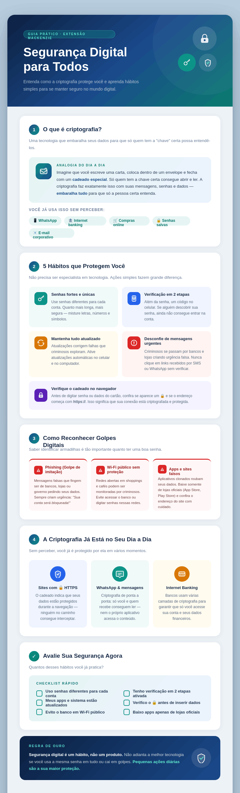

# UNIVERSIDADE PRESBITERIANA MACKENZIE
## Projeto de Extensão: Criptografia Explicada e Aplicada a Segurança de Dados

Autores:

|Nome|RA|Curso|
|---|---|---|
|Thomaz de Souza Scopel|10417183|Ciência da Computação 7º Semestre|
|Matheus Gabriel Viana Araujo|10420444|Ciência da Computação 6º Semestre|
|Yating Zheng  |10439511|Ciência da Computação 5º Semestre|
|João Silveira Campos Neto|10441670|Ciência de Dados 5º Semestre|

## 🛡️ Criptografia Cidadã - Protegendo sua Casa Digital

Bem-vindo ao repositório do nosso projeto de extensão universitária! Este espaço foi criado com um objetivo claro: **democratizar o conhecimento sobre segurança da informação para o cidadão comum**, eliminando o excesso de jargões técnicos e focando no que realmente importa para a proteção da nossa privacidade no dia a dia.

---

### 📖 Sobre o Projeto

Vivemos na era da informação, onde nossos dados (mensagens, fotos, senhas e informações bancárias) transitam pela internet a todo momento. Infelizmente, megavazamentos de dados se tornaram uma ameaça real. 

> 📊 **Dado Alarmante:** De acordo com o *Relatório do Custo das Violações de Dados 2025* da IBM, o custo médio global de um vazamento para as organizações atingiu a marca de **US$ 4,88 milhões**, sendo as Informações de Identificação Pessoal (PII) dos clientes o alvo principal dos criminosos na maioria dos casos.

Diante de um cenário onde golpes como o *phishing* (mensagens falsas que induzem o usuário a entregar seus dados) lideram como a principal porta de entrada para invasores, como podemos nos proteger?

A resposta é a **Criptografia**. Em termos simples, ela funciona como um cofre de alta segurança trancado por um cadeado virtual. Ela transforma mensagens legíveis em um emaranhado de códigos indecifráveis, garantindo que, mesmo que um criminoso intercepte a sua correspondência digital, ele não consiga abri-la sem a "chave física" correta. 

Nosso projeto traduz esses conceitos matemáticos complexos (como os algoritmos AES e RSA) para a nossa realidade cotidiana, capacitando o usuário a assumir o protagonismo na defesa de sua identidade digital.

---

### 📂 Entregas e Recursos

Aqui você encontra todos os materiais desenvolvidos para facilitar o aprendizado (focados em *microlearning*), divididos conforme os requisitos do projeto.

#### 📝 1. Texto Técnico
O núcleo teórico da nossa pesquisa. Um documento formatado para leitura na web (escaneabilidade), focado em explicar a problemática dos vazamentos de dados, o funcionamento dos "cadeados virtuais" e as melhores práticas de defesa para o cidadão.
*   🔗 **Acesse o documento completo aqui:** [Texto Técnico](Texto-Tecnico-Criptografia.pdf)

#### 🎥 2. Vídeo Demonstrativo
Uma síntese em vídeo, direta e visual, apresentando a importância de proteger nossos dados e como a criptografia atua nos bastidores.
*   🎬 **Assista ao vídeo:** [Criptografia Explicada e Aplicada a Segurança de Dados](https://youtu.be/8mKnQ-sTE2U?si=MjI5sAFmA38_uqhX)
*   ⏱️ **Duração:** 10 minutos *(Resolução Full HD 1080p, com legendas para acessibilidade)*.

#### 🎙️ 3. Podcast: O Segredo dos Cadeados Digitais
Um bate-papo descontraído em formato de perguntas e respostas com um especialista convidado. Ideal para ouvir no trajeto para o trabalho ou faculdade.
*   🎧 **Ouça o episódio:** [Podcast sobre Criptografia](https://youtu.be/5cZWZmI87D8?si=rYbi1oywNGCm2zNQ)
*   ⏱️ **Duração:** 17 minutos.

#### 🧠 4. Quiz de Fixação
Teste os seus conhecimentos! Preparamos um formulário com questões de múltipla escolha baseadas em situações do dia a dia. Ao responder, você recebe um feedback instantâneo explicando o porquê de cada resposta.
*   ✏️ **Faça o Quiz aqui:** [Quiz](https://araujoviana.github.io/quiz-cybersec/)

#### 📊 5. Guia de Referência Rápida (Infográfico)
Precisa relembrar rapidamente o que fazer para se proteger? Nosso infográfico visual traz um "Checklist de Segurança" com ícones e cores que facilitam a leitura. Salve a imagem abaixo no seu celular ou imprima para consultas rápidas!

*

---

### 🔗 Para Saber Mais

Se você se interessou pelo o tema, ou ainda ficou confuso sobre algum tópico, seguem ótimos vídeos explicativos abaixo para assistir sobre criptografia:

| Referência | Descrição |
| :--- | :--- |
| 📄 **[MENSAGEM SECRETA: Entenda a CRIPTOGRAFIA](https://youtu.be/aTI99jztZds?si=zzEs5WFjZlCUPOpV)** | Um vídeo do Manual do Mundo que exemplifica muito bem os processos de criptografia Simétrica e Assimétrica. |
| 📄 **[Como a Criptografia Quântica Funciona ](https://youtu.be/M30ELGnjywY?si=C1OkikAsLh8A2g4z)** | Para saber mais sobre o tópico e o futuro, um vídeo do canal Ciência Todo Dia, onde Pedro Loos conta mais sobre Criptografia Quântica.|
| 📄 **[Criptografia (Guia Básico para Entender Como Funciona)](https://youtu.be/qHFbuXpz7e4?si=SPU6t7zaNhJ9Ez1U)** | Um vídeo do canal Código Fonte TV, que demonstra os principais algorimos e alguns programas executando eles. |
